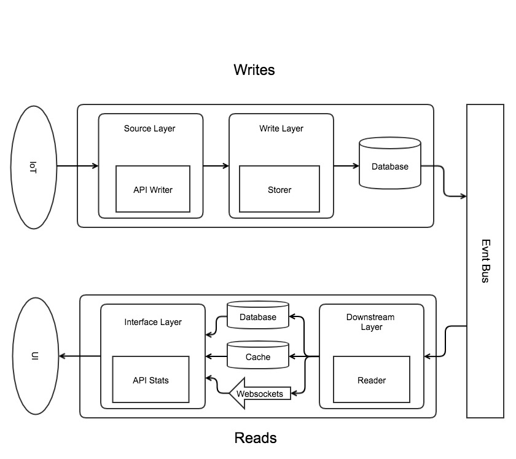

# Use case

We own a transport company and we want to improve the monitoring on our vehicles to get
useful metrics so we can study and understand our drivers behaviour. To do so we have 
installed 2 kind of sensors in each vehicle: One for the fuel status and the other for
the localization obtained by GPS.

We want an application that is able to handle a huge amount of sensors, to be fast,
reliable and easily queryable for monitoring metrics.

# Requirements 

- install docker
- install java 8
- install scala 12
- install sbt 1

# Run

Clone the project in your PC. We will use docker-compose to launch the app example
It is needed to setup your current IP as an environment variable with name `HOST_IP`.
You can check it in you OS settings or, if you run on MAC or Linux OS, run:

```bash
export HOST_IP=`ipconfig getifaddr en0`
``` 

Afterwards, In the root directory run:

```
sbt docker
docker-compose -f docker/docker-compose.yml up
```

7 containers should be running (they are explained in the next section), they may
take a while until the cluster converge. If one or some of the containers are killed
just start it again using:

```bash
docker-compose -f docker/docker-compose.yml up container_name
```

> Don't forget to set `HOST_IP` environment variable if you started another shell
session!!!

> The following ports are used: 7000, 7001, 7199, 9042, 9160, 8080, 2540, 8081, 
2520, 2550, 2551, 2552, 2531, 2532. They can be changed in the docker-compose
file located in `docker/docker-compose.yml`

When the log traces stream stops then we can start to test the application.
Here are some curl commands:

```bash
# Get cluster status
curl 127.0.0.1:8080/status

# Post a fuel command
curl 127.0.0.1:8080/vehicle/status/fuel -d '{"id": "2", "timestamp": 1529759273, "fuelStatusPercent": 50}' -H "Content-Type: application/json"

# Post a position command
curl 127.0.0.1:8080/vehicle/status/position -d '{"id": "1", "timestamp": 1529759273, "position": {"x": 22, "y": 2}}' -H "Content-Type: application/json"

# Get some statistics: total distance, current position and current fuel status
curl 127.0.0.1:8081/vehicle/stats/{id}
``` 

In addition, a basic test plan has been provided. To run it:

```bash
sbt "project simulation" "run 5"
```

In this case, 5 is the number of vehicles that will run, if no number is provided, it is
default to 3. Every client launch a pair of Fuel and Position events.

To see how the cluster scales and recovery from crash, this command can be run to
stop a container. The most interesting nodes to check the scaling up/down is the
'storer' kind containers.

```bash
# To stop a node starting by docker compose
docker-compose -f docker/docker-compose.yml stop container_name

# Example of how to start an extra node that is not registered by docker compose. AKKA_PORT ev must match the exposed port
docker run -p 2553:2551 -e "AKKA_HOST=${HOST_IP}" -e "AKKA_PORT=2553" iot-assignment-storer

```

> Notice that, under the current configuration, at least one of the containers
exposed under ports 2550 and 2551 ( storer_1 and storer_2 ) should be up so new 
nodes can join into the cluster

# Architecture

The application runs on an Akka Actors Cluster (Language is Scala but there is a
Java API as well). Akka actors is a design pattern that excels in several fields:
- Location transparency: This means that where the actor runs (same JDK or different server), 
it's just a matter of configuration
- Handle state on asynchronous systems.
- Fail recovery and resiliency.

In order to improve the reads and writes performance, a CRQS architecture is used.
This means that the reads and writes are decoupled in different systems since they 
have different requirements:

- writes needs to be reliables
- reads needs to be fast



> Every layer in the schema above relates to one module in the app

## Writes Side

To maximise the throughput in the writes side, we are using Cassandra together with
Event Sourcing. Event Sourcing is a technique to handle events in which you store
every single event. Nothing is updated or deleted, state is not keep in the database
but the events that drives to that state. This has several benefits:

- Store data is very efficient, it is only ADD registers.
- No data lost. What happens if the business logic changes or if there was a bug?
We just need to re-run the data applying the new logic changes.

Of course Event Sourcing has some problems as well but Akka help us to fix them:

- Takes long to read all the events after a restart. To minimize this, snapshots 
are created, they contains the current state every X events so we can start from there.
- Is hard to read, How to query?. Every vehicle set of events are handle by a single
actor so this actor keeps the state in memory until it's not needed. This way we
can validate events based on the current state and no hit to the database is needed.
(maximising the writes)

## Reads Side

Once that the events have been stored into the database they are pushed through 
an event stream so an independent app can consume and prepare them to be exposed. 
In our case, and for convenience, a message is sent withing the cluster to another
node but this task could be achieve as well with a microservice endpoint or an 
event bus (like Kafka or Kinesis) so we can decouple the different layers from 
each other, making it possible to use other technologies.

Our downstream application just storage data in memory so it's lost if the actor
is stopped. This can be fine for some cases but probably we want to persist the
data to be query later, Read oriented databases as ElasticSearch or Distributed 
Cached systems as Hazelcast can be used. Other possibility is that the downstream 
app push the data to a Websocket channel. In the case of storage the data in a 
database it's common that the downstream app aggregates the data by it's own so 
the writes can be reduced.

The last part of the Read Side is the interface to the user that wants to query
it. In our case is just a REST API.

# A word on

## Messaging reliability

Akka uses a 'at most once' model for messaging. This means that some messages can be
lost at some (rare) case. The reason is Akka has been built with performance in 
mind. For some case, like this one, could be worthy to lose some messages and to
not lose performance ACKing messages.

## Messages serialization

By default, Akka uses Java serialization to send the messages, which is awful. 
It is possible to use other serializers like Protobuf to improve the performance
and network usage.